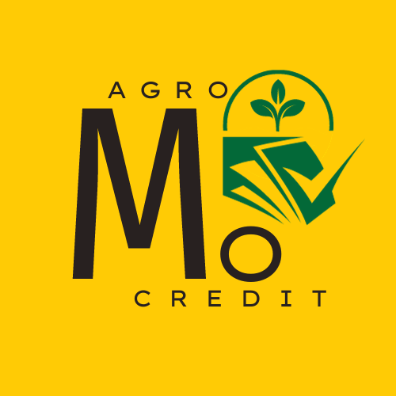

<a name="readme-top"></a>

<div align="center">
  
  <br/>

  <h3><b>AGROMOCREDIT README</b></h3>

</div>

# 📗 Table of Contents

- [📖 About the Project](#about-project)
  - [🛠 Built With](#built-with)
    - [Tech Stack](#tech-stack)
    - [Key Features](#key-features)
  - [🚀 Live Demo](#live-demo)
- [💻 Getting Started](#getting-started)
  - [Prerequisites](#prerequisites)
  - [Setup](#setup)
  - [Install](#install)
  - [Usage](#usage)
  - [Run tests](#run-tests)
  - [Deployment](#deployment)
- [👥 Authors](#authors)
- [🔭 Future Features](#future-features)
- [🤝 Contributing](#contributing)
- [⭐️ Show your support](#support)
- [🙏 Acknowledgements](#acknowledgements)
- [❓ FAQ (OPTIONAL)](#faq)
- [📝 License](#license)

<!-- PROJECT DESCRIPTION -->

# 📖 AGRICULTURAL SUPPORT APP (AGROMOCREDIT) <a name="about-project"></a>

**AGROMOCREDIT** is an innovative Mobile App that empowers small-scale farmers in Uganda by leveraging the MoMo API to facilitate direct payments, cashless transactions, and access to credit services. This repository contains the code and resources that drive this transformative solution, enhancing farmers' financial inclusion and access to crucial resources within the agriculture sector.

## 🛠 Built With <a name="built-with"></a>

### Tech Stack <a name="tech-stack"></a>

<details>
  <summary>Client</summary>
  <ul>
    <li><a href="https://reactnative.dev">React Native</a></li>
  </ul>
</details>

<details>
  <summary>Server</summary>
  <ul>
    <li><a href="https://tomcat.apache.org/">Tomact</a></li>
  </ul>
</details>

<details>
<summary>Database</summary>
  <ul>
    <li><a href="https://www.postgresql.org/">PostgreSQL</a></li>
  </ul>
</details>

<!-- Features -->

### Key Features <a name="key-features"></a>

- **[1]** Authentication (Signup and Sign in)
- **[2]** Receive Money from buyers
- **[3]** Withdraw Money from the app
- **[4]** Transfer Money to MTN MoMo users
- **[5]** Get a Loan based on your credit score at 8% Interest Rate
- **[6]** Repay Loan before it's due
- **[7]** Buy farming tools from App Market Place

<p align="right">(<a href="#readme-top">back to top</a>)</p>

<!--
## 🚀 Live Demo <a name="live-demo"></a>

> Add a link to your deployed project.

- [Live Demo Link](https://google.com)
-->
<p align="right">(<a href="#readme-top">back to top</a>)</p>

## 💻 Getting Started <a name="getting-started"></a>

To get a local copy up and running, follow these steps.

### Prerequisites

In order to run this project you need:

### Setup

Clone this repository to your desired folder:

```sh
  cd my-folder
  git clone https://github.com/inspecta/Agricultural-Support-App.git
```

### Install

Install this project with:

```sh
  cd agromocredit
  npm install
```

### Usage

To run the project, execute the following command:

```sh
  npm start
```
<!--
### Run tests

To run tests, run the following command:
-->

### Deployment

You can create an APK using Expo (Set of tools and services built around React Native)

<p align="right">(<a href="#readme-top">back to top</a>)</p>

## 👥 Authors <a name="authors"></a>

👤 **Author1**

- GitHub: [@inspecta](https://github.com/inspecta)
- Twitter: [@djmulinde](https://twitter.com/djmulinde)
- LinkedIn: [Derrick Mulinde](https://linkedin.com/in/derrick-mulinde)

👤 **Author2**

- GitHub: [@JonahKayizzi](https://github.com/JonahKayizzi)
- LinkedIn: [Jonathan Kayizzi](https://www.linkedin.com/in/jonathan-kayizzi/)

👤 **Author3**

- GitHub: [@Balikuddembe](https://github.com/Balikuddembe)
- LinkedIn: [Emmanuel Balikuddembe](https://www.linkedin.com/in/emmanuelbalikuddembe/)

<p align="right">(<a href="#readme-top">back to top</a>)</p>

## 🔭 Future Features <a name="future-features"></a>

- [ ] **[1]** Secure authentication
- [ ] **[2]** Going live with MTN
- [ ] **[3]** Encorporating more farming services

<p align="right">(<a href="#readme-top">back to top</a>)</p>

## 🤝 Contributing <a name="contributing"></a>

Contributions, issues, and feature requests are welcome!

Feel free to check the [issues page](../../issues/).

<p align="right">(<a href="#readme-top">back to top</a>)</p>

<!-- SUPPORT -->

## ⭐️ Show your support <a name="support"></a>

If you like this project, please give it a star.

<p align="right">(<a href="#readme-top">back to top</a>)</p>

## 🙏 Acknowledgments <a name="acknowledgements"></a>

I want to thank Matte Ismail, Joy Bakesiga, Emmanuel Balikuddembe, and Jonathan Kayizzi for all their hard work during this project development. 

<p align="right">(<a href="#readme-top">back to top</a>)</p>

## ❓ FAQ (OPTIONAL) <a name="faq"></a>

- **[1]** Can I clone and use this project's source code?

  - No.

- **[2]** Can I contribute to this project?

  - Yes, contact me @djmulinde@gmail.com and I'll add you as a contributor to this project.

<p align="right">(<a href="#readme-top">back to top</a>)</p>

## 📝 License <a name="license"></a>

This project is [MIT](./LICENSE) licensed.


<p align="right">(<a href="#readme-top">back to top</a>)</p>
